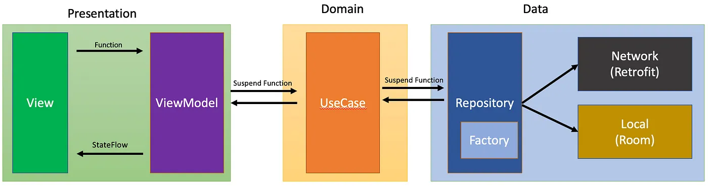

# AJC-MVVM

Simple app with MVVM architecture, learn everything from scratch.

# What will you learn?
- How to setup simple app with [MVVM architecture](https://medium.com/@ami0275/mvvm-clean-architecture-pattern-in-android-with-use-cases-eff7edc2ef76)
- [Hilt](https://developer.android.com/training/dependency-injection/hilt-android)
- [Retrofit](https://daily.dev/blog/retrofit-tutorial-for-android-beginners)
- [Room database](https://developer.android.com/training/data-storage/room)
- [State in composables](https://developer.android.com/develop/ui/compose/state)
- [Version catalogs](https://developer.android.com/build/migrate-to-catalogs)
- [Kotlin Flow](https://developer.android.com/kotlin/flow)
- [Kotlin Coroutine](https://developer.android.com/kotlin/coroutines)

